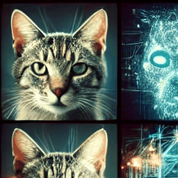
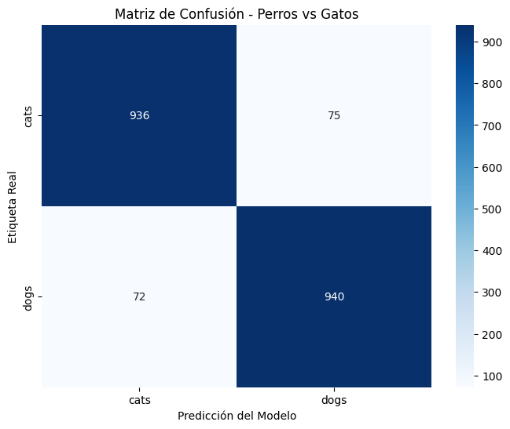

# 🐶🐱 Clasificación de Perros y Gatos con PyTorch

<p align="center">
  
</p>

<p align="center">
  
  
  
  
</p>

---

## 📋 Descripción

Proyecto de **Deep Learning** que implementa y compara dos enfoques para la clasificación de imágenes de perros y gatos:

1. **`DeepLearning_Diego_Roman.ipynb`** — Exploración didáctica de conceptos de Deep Learning con PyTorch: tensores, autograd, CNNs básicas, y fundamentos matemáticos.
2. **`recognition_dogs_cats.ipynb`** — Pipeline completo de producción que compara una **CNN personalizada** vs. **Transfer Learning con ResNet18**.

**Dataset:** [Cat and Dog - Kaggle](https://www.kaggle.com/datasets/tongpython/cat-and-dog) (~10,000 imágenes)

---

## 📓 Notebooks

### 1. `DeepLearning_Diego_Roman.ipynb` — Fundamentos
Notebook educativo que cubre los conceptos base necesarios para entender el proyecto principal:
- Operaciones con tensores en PyTorch
- Diferenciación automática (Autograd)
- Construcción de CNNs desde cero
- Funciones de pérdida y optimizadores
- Visualización de características aprendidas

### 2. `recognition_dogs_cats.ipynb` — Pipeline Completo
Pipeline de clasificación binaria (Perro / Gato) que incluye:

| Fase | Descripción |
|---|---|
| **Data Augmentation** | Flip horizontal, rotación ±10°, color jitter, normalización ImageNet |
| **Experimento 1** | CNN personalizada de 3 bloques conv. con BatchNorm y Dropout |
| **Experimento 2** | ResNet18 preentrenada con Feature Extraction (backbone congelado) |
| **Evaluación** | Accuracy, Precision, Recall, F1-Score y Matriz de Confusión |

---

## 📊 Resultados

| Modelo | Accuracy | Precision | Recall | F1-Score |
|---|:---:|:---:|:---:|:---:|
| **ImprovedCNN** (desde cero) | 81% | 0.82 | 0.81 | 0.81 |
| **ResNet18** (Transfer Learning) | **93%** | **0.93** | **0.93** | **0.93** |

**Matriz de Confusión-Perros vs Gatos**



> **Conclusión:** Transfer Learning supera en **+12 puntos porcentuales** a la CNN personalizada entrenando los mismos datos y épocas, demostrando el poder del conocimiento previo de ImageNet.

---

## 🚀 Instalación y Uso

Este proyecto usa **[uv](https://docs.astral.sh/uv/)** como gestor de paquetes y entornos virtuales — una alternativa moderna y ultrarrápida a `pip` + `venv`.

### Prerequisitos
- Python ≥ 3.14
- [uv](https://docs.astral.sh/uv/) instalado
- Cuenta de Kaggle con credenciales configuradas

### 1. Clonar el repositorio
```bash
git clone https://github.com/DiegoRomanP/Recognition-of-dogs-and-cats.git
cd Recognition-of-dogs-and-cats
```

### 2. Crear entorno e instalar dependencias con uv
```bash
# uv crea el entorno virtual y sincroniza todas las dependencias automáticamente
uv sync
```

> `uv sync` lee el archivo `pyproject.toml` e instala exactamente las versiones
> especificadas en `uv.lock`, garantizando reproducibilidad total.

### 3. Configurar credenciales de Kaggle
```bash
# Asegúrate de tener ~/.kaggle/kaggle.json con tu API key
# Descárgalo desde: https://www.kaggle.com/settings → API → Create New Token
```

### 4. Ejecutar los notebooks
```bash
# Activar el entorno virtual
source .venv/bin/activate   # Linux/Mac
# .venv\Scripts\activate    # Windows

# Abrir Jupyter
jupyter notebook
```

Abre `recognition_dogs_cats.ipynb` y ejecuta las celdas en orden. El dataset se descarga automáticamente en la primera celda.

---

## 📦 Dependencias Principales

Gestionadas con `uv` a través de `pyproject.toml`:

| Librería | Versión | Uso |
|---|---|---|
| `torch` | ≥ 2.11 | Motor de deep learning |
| `torchvision` | ≥ 0.26 | Modelos preentrenados y transformaciones |
| `torchmetrics` | ≥ 1.9 | Métricas avanzadas (F1, Precision, Recall) |
| `scikit-learn` | ≥ 1.8 | Matriz de confusión y reporte de clasificación |
| `matplotlib` + `seaborn` | — | Visualización |
| `kagglehub` | ≥ 1.0 | Descarga automática del dataset |
| `numpy` | ≥ 2.4 | Operaciones numéricas |

---

## 🗂️ Estructura del Proyecto

```
Recognition-of-dogs-and-cats/
│
├── 📓 DeepLearning_Diego_Roman.ipynb  # Fundamentos de Deep Learning
├── 📓 recognition_dogs_cats.ipynb     # Pipeline principal (CNN vs ResNet18)
│
├── pyproject.toml                     # Configuración del proyecto y dependencias (uv)
├── uv.lock                            # Versiones exactas de dependencias (uv)
├── .python-version                    # Versión de Python del proyecto
│
├── cnn_classification.gif             # Animación del README
├── README.md                          # Este archivo
└── LICENSE                            # Licencia MIT
```

> **Nota:** El directorio `data/` (dataset) y los archivos `.pth` (pesos del modelo) están en `.gitignore` por su tamaño. El dataset se descarga automáticamente al ejecutar el notebook.

---

## 🔧 Gestión de Dependencias con uv

```bash
# Añadir una nueva dependencia
uv add nombre-paquete

# Actualizar todas las dependencias
uv sync --upgrade

# Ver dependencias instaladas
uv pip list

# Ejecutar un script dentro del entorno sin activarlo
uv run python script.py
```

---

## 📄 Licencia

Este proyecto está bajo la **Licencia MIT**. Ver el archivo [LICENSE](LICENSE) para más detalles.

---

<p align="center">
  Hecho con ❤️ por <a href="https://github.com/DiegoRomanP">Diego Román</a>
</p>
